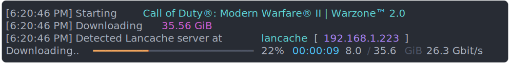
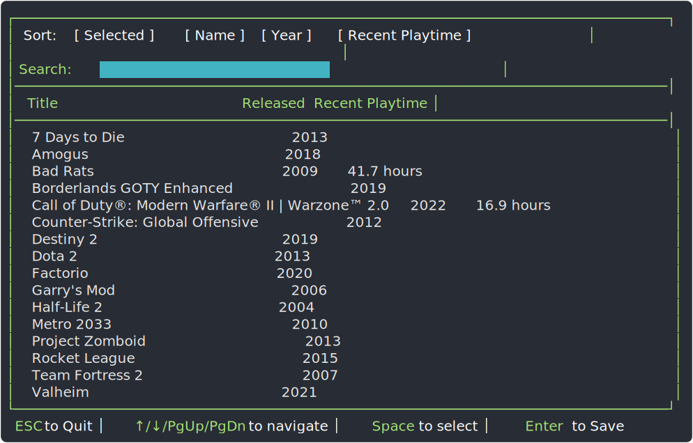
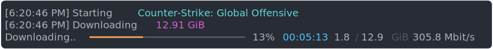
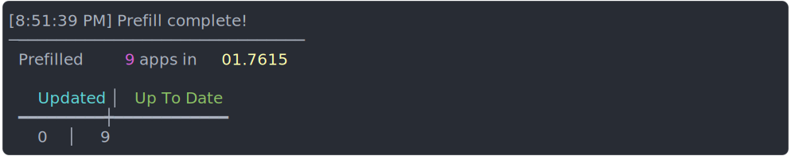
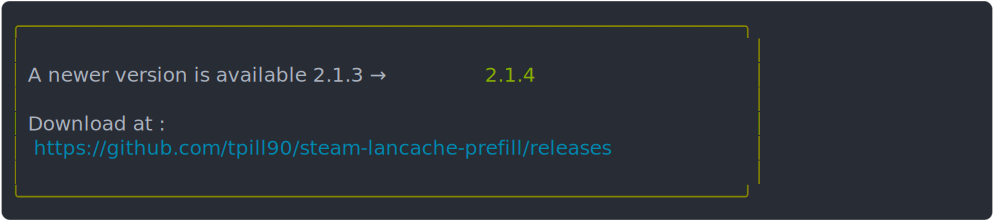

# steam-lancache-prefill

[](https://discord.com/invite/BKnBS4u)
[](https://tpill90.github.io/steam-lancache-prefill/)
[](https://ko-fi.com/Y8Y5DWGZN)


[](https://hub.docker.com/r/tpill90/steam-lancache-prefill)

Automatically fills a [Lancache](https://lancache.net/) with games from Steam, so that subsequent downloads for the same content will be served from the Lancache, improving speeds and reducing load on your internet connection.



# Features

- Selecting which apps to prefill can be done through an interactive menu.
- Supports login with Steam Guard, and Steam Guard Mobile Authenticator
- No installation required! A completely self-contained, portable application.
- Multi-platform support (Windows, Linux, MacOS, Arm64, Docker, Unraid)
- High-performance! Downloads are significantly faster than using Steam. Downloads can scale all the way up to 100gbit/s!
- Game downloads write no data to disk, so there is no need to have enough free space available. This also means no unnecessary wear-and-tear to SSDs!
- Includes a built in benchmark feature for diagnosing performance bottlenecks!

# Table of contents

- [Installation](#installation)
- [Getting Started](#getting-started)
- [Frequently Asked Questions](#frequently-asked-questions)
- [Detailed Command Usage](#detailed-command-usage)
- [Updating](#updating)
- [Need Help?](#need-help)

# Installation

**SteamPrefill** is flexible and portable, and supports multiple platforms and configurations. It can be run on directly on the Lancache server itself, or on your gaming machine as an alternative Steam client. You should decide which one works better for your use case.

Detailed setup guides are available for the following platforms:

<a target="_blank" href="https://tpill90.github.io/steam-lancache-prefill/install-guides/Linux-Setup-Guide">
    
</a> &nbsp;
<a target="_blank" href="https://tpill90.github.io/steam-lancache-prefill/install-guides/Docker-Setup-Guide">
    
</a> &nbsp;
<a target="_blank" href="https://tpill90.github.io/steam-lancache-prefill/install-guides/Unraid-Setup-Guide">
    
</a> &nbsp;
<a target="_blank" href="https://tpill90.github.io/steam-lancache-prefill/install-guides/Windows-Setup-Guide">
    
</a>

<br/>

# Getting Started

## Selecting what to prefill

> [!WARNING]
> This guide was written with Linux in mind. If you are running **SteamPrefill** on Windows you will need to substitute `./SteamPrefill` with `.\SteamPrefill.exe` instead.

Prior to prefilling for the first time, you will have to decide which apps should be prefilled. This will be done using an interactive menu, for selecting what to prefill from all of your currently owned apps. To display the interactive menu, run the following command

```powershell
./SteamPrefill select-apps
```

Once logged into Steam, all of your currently owned apps will be displayed for selection. Navigating using the arrow keys, select any apps that you are interested in prefilling with **space**. Once you are satisfied with your selections, save them with **enter**.



These selections will be saved permanently, and can be freely updated at any time by simply rerunning `select-apps` again at any time.

## Initial prefill

Now that a prefill app list has been created, we can now move onto our initial prefill run by using

```powershell
./SteamPrefill prefill
```

The `prefill` command will automatically pickup the prefill app list, and begin downloading each app. During the initial run, it is likely that the Lancache is empty, so download speeds should be expected to be around your internet line speed (in the below example, a 300mbit/s connection was used). Once the prefill has completed, the Lancache should be fully ready to serve clients cached data.



## Updating previously prefilled apps

Updating any previously prefilled apps can be done by simply re-running the `prefill` command, which will use same prefill app list as before.

**SteamPrefill** keeps track of which version of each app was previously prefilled, and will only re-download if there is a newer version of the app available. Any apps that are currently up to date, will simply be skipped. The number of apps already up to date will be displayed in the end of run summary table:



However, if there is a newer version of an app that is available, then **SteamPrefill** will re-download the app. Due to how Lancache works, this subsequent run should complete much faster than the initial prefill (example below used a 10gbit connection).
Any data that was previously downloaded, will be retrieved from the Lancache, while any new data from the update will be retrieved from the internet. Any apps that have been updated will be counted towards the "Updated" column in the end of run summary.


# Frequently Asked Questions

> [!NOTE]
> FAQs have been moved to the project wiki. A table of contents is provided here for convenience and visibility : [Frequently Asked Questions](https://tpill90.github.io/steam-lancache-prefill/faq/)

- [I have to login with my password? How do I know this is safe?](https://tpill90.github.io/steam-lancache-prefill/faq/#i-have-to-login-with-my-password-how-do-i-know-this-is-safe)
- [Can I run SteamPrefill on the Lancache server?](https://tpill90.github.io/steam-lancache-prefill/faq/#can-i-run-steamprefill-on-the-lancache-server)
- [Can SteamPrefill be run on a schedule?](https://tpill90.github.io/steam-lancache-prefill/faq/#can-steamprefill-be-run-on-a-schedule)
- [Can I fill my cache using previously installed Steam games?](https://tpill90.github.io/steam-lancache-prefill/faq/#can-i-fill-my-cache-using-previously-installed-steam-games)
- [Where does SteamPrefill store downloads?](https://tpill90.github.io/steam-lancache-prefill/faq/#where-does-steamprefill-store-downloads)
- [How do I pause my running downloads?](https://tpill90.github.io/steam-lancache-prefill/faq/#how-do-i-pause-my-running-downloads)
- [Is it possible to prefill apps I don't own?](https://tpill90.github.io/steam-lancache-prefill/faq/#is-it-possible-to-prefill-apps-i-dont-own)
- [How can I limit download speeds?](https://tpill90.github.io/steam-lancache-prefill/faq/#how-can-i-limit-download-speeds)
- [My logs have weird characters that make it hard to read. Is there any way to remove them?](https://tpill90.github.io/steam-lancache-prefill/faq/#my-logs-have-weird-characters-that-make-it-hard-to-read-is-there-any-way-to-remove-them)
- [Can I use more than one Steam account at the same time?](https://tpill90.github.io/steam-lancache-prefill/faq/#can-i-use-more-than-one-steam-account-at-the-same-time)

# Detailed Command Usage

More in depth documentation on SteamPrefill's various commands can be found on the project wiki.

- Looking to see what other options can be used with `prefill`?  See [prefill](https://tpill90.github.io/steam-lancache-prefill/detailed-command-usage/Prefill/)
- Interested to seeing the total download size of your selected apps? Try [select-apps status](https://tpill90.github.io/steam-lancache-prefill/detailed-command-usage/Select-Apps/#status)
- Getting slow downloads from your cache, and interested in diagnosing it?  Use the [benchmark](https://tpill90.github.io/steam-lancache-prefill/detailed-command-usage/Benchmark)


# Updating

**SteamPrefill** will automatically check for updates, and notify you when an update is available :



### Automatically updating

- **Windows**
  - Run the `.\update.ps1` script in the executable directory
- **Linux**
  - **First time only** : Grant executable permissions to the update script with `chmod +x ./update.sh`
  - Run the `./update.sh` script in the executable directory
- **Docker**
  - `docker pull tpill90/steam-lancache-prefill:latest`

### Manually updating:

1.  Download the latest version for your OS from the [Releases](https://github.com/tpill90/steam-lancache-prefill/releases) page.
2.  Unzip to the directory where **SteamPrefill** is currently installed, overwriting the previous executable.
3.  Thats it! You're all up to date!

# Need Help?

If you are running into any issues, feel free to open up a Github issue on this repository.

You can also find us at the [**LanCache.NET** Discord](https://discord.com/invite/BKnBS4u), in the `#steam-prefill` channel.

# Want to Contribute?

There is additional documentation over on the project wiki that can help you get started!  Interested in modifying and compiling the project from source? See [Compiling From Source](https://tpill90.github.io/steam-lancache-prefill/dev-guides/Compiling-from-source/).  Noticed something in the documentation needs updating?  See [Working With Project Documentation](https://tpill90.github.io/steam-lancache-prefill/dev-guides/mkdocs-setup/)

# Acknowledgements

- [@dlrudie](https://github.com/dlrudie) for all your help with debugging and testing!
