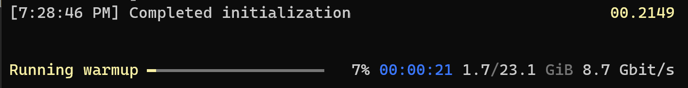
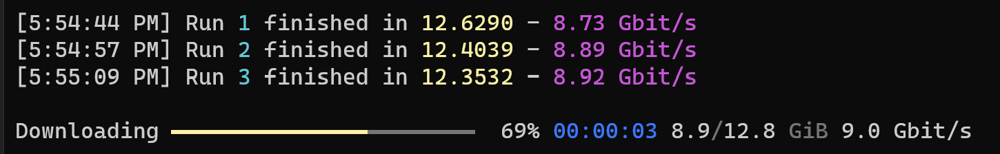
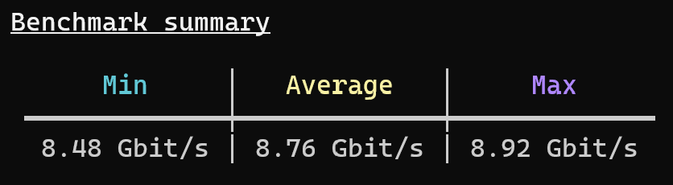
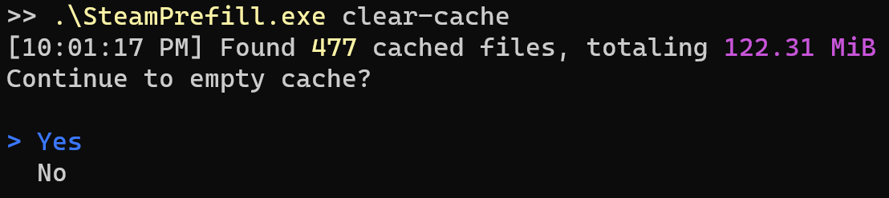

# Detailed Command Usage

## prefill

Automatically fills a Lancache with games from Steam so that subsequent downloads will be served from the Lancache, improving speeds and reducing load on your internet connection.

Will keep track of which games have been previously downloaded, and will only download games that have updates.

| Option      |     | Values                | Default     |     |
| ----------- | --- | --------------------- | ----------- | --- |
| --os        |     | windows, linux, macos | **windows** | Specifies which operating system(s) games should be downloaded for.  Typically, almost all games support Windows, however there are increasingly more games that have Linux specific game files.  In some cases, the Linux game files may be as large as the Windows version. |
| --all       |     |                       |             | Downloads all owned apps, useful for prefilling a completely empty cache.  |
| --recent    |     |                       |             | Adds any games played within the last 2 weeks to the download queue.  |
| --top       |     | 1-100                 | **50**      | Downloads the most popular games by player count, over the last 2 weeks.  |
| --force     | -f  |                       |             | By default, **SteamPrefill** will keep track of the most recently prefilled apps, and will only attempt to prefill if there it determines there a newer version available for download.  This default behavior will work best for most use cases, as no time will be wasted re-downloading files that have been previously prefilled.     Running with the flag `--force` will override this behavior, and instead will always run the prefill, re-downloading all files for the selected apps.  This flag may be useful for diagnostics, or benchmarking network performance.  |
| --nocache   |     |                       |             | **SteamPrefill** will cache copies of certain files on disk, in order to dramatically speed up future runs.  These cache files will be stored in the `/Cache` directory in the same directory as **SteamPrefill**.  However, in some scenarios this disk cache can potentially take up a non-trivial amount of storage (~1gb), which may not be ideal for all use cases. |
| --verbose   |     |                       |             | Produces more detailed log output.  By default, games that are already up to date will not be displayed at all.  Specifying this option will make it so that all games, even ones up to date, will be logged.  |
| --unit      |     | bits, bytes           | **bits**    | Specifies which unit to use to display download speed.   |
| --no-ansi   |     |                       |             | Application output will be in plain text, rather than using the visually appealing colors and progress bars.  Should only be used if terminal does not support Ansi Escape sequences, or when redirecting output to a file. |

## benchmark

Intended for use in identifying potential bottlenecks both server side (usually disk IO), as well as client side.

<!-- TODO don't like this line -->
`Benchmark` uses the same download logic as `prefill`, however it offers the following instead:

<!-- TODO touch this up -->
- Portable, no need to login to Steam in order to start download.
- Able to be used across multiple machines at the same time, without logging in
- Continous sustained download, combines multiple apps into a single download
- Repeatable, will perform the same download every time
- Randomized, requests will be completed in a random order

##### setup

Creates a benchmark "workload" comprised of multiple apps, that will then be benchmarked using the `run` sub-command.

<!-- Markdown columns determine width based on the the longest cell.  &nbsp; forces the length to be longer, so --use-selected doesn't get broken into two lines  -->
| Option   &nbsp; &nbsp; &nbsp; &nbsp; &nbsp; &nbsp; &nbsp;  |     |
| ---------------- | --- |
| --use-selected | Creates a workload file using apps previously specified with `select-apps`.  Ideal for most use cases, since it likely aligns with games that will be downloaded by real event clients. |
| --all          | Benchmark workload will be created using all currently owned apps.  |
| --appid        | The id of one or more apps to include in benchmark workload file.  Useful for testing a specific app, without having to modify previously selected apps.  AppIds can be found using [SteamDB](https://steamdb.info/)  |
| --nocache      | Skips using locally cached files.  No recommended for use with `setup`, as it can dramatically increase the amount of time to build the workload file. |
| --no-ansi      |      Application output will be in plain text, rather than using the visually appealing colors and progress bars.  Should only be used if terminal does not support Ansi Escape sequences, or when redirecting output to a file. |

### run

Runs multiple iterations of the benchmark workload created with `benchmark setup`.  Useful for measuring the throughput for the Lancache server, and diagnosing any potential performance issues.

<u>** Warmup **</u>

{: style="width:750px"}

The first part of the benchmark run will be the intialization + warmup of the workload.  The workload file previously created with `benchmark setup` will be loaded from disk, and the ordering of the requests to be made will be randomized.  

Next, the warmup run will download all of the workload's requests, which is necessary for a few reasons:

- It ensures that all of the data has been downloaded, and is cached by the Lancache.
- Allows for data that has been cached in the server's memory to be flushed by the new requests, ensuring that we are testing disk I/O.
- Gives the CPU a chance to physically warm up,  minimizing potential fluctuations between runs.

<u>** Running **</u>

After the warmup, `benchmark run` will begin downloading the same workload in a loop, for as many iterations as specified with `--iterations` (default: 5).  After each iteration, it will display the overall average download rate for that iteration.

{: style="width:750px"}

Once all the iterations have been completed, a summary table displaying the min/max/average will be shown:

{: style="width:450px"}

<u>** Identifying bottlenecks **</u>

While `benchmark run` is useful for getting an overall idea of your server's performance, it won't however identify bottlenecks in the system by itself.  It is instead primarily intended to be another tool to help with identifying bottlenecks,  by providing a constant and even load on the server.

It is recommended that you run some sort of system monitoring software on the server while running your benchmarks, so that you can get an idea of how your server is handling the load.  There are many monitoring tools available,  such as [Glances](https://github.com/nicolargo/glances), that provide a visual overview of the system.

Two important measurements to keep an eye on, are the overall `CPU` usage, as well as `iowait`.  The majority of bottlenecks for servers will be either the speed of the CPU, or the speed at which the disk(s) can read.

{: style="width:450px"}

| Option        |     | Values        | Default |     |
| ------------- | --- | ------------- | ------- | --- |
| --concurrency | -c  | 1-100         | **30**  | The maximum number of concurrent requests in flight at one time.  A higher number may improve maximum throughput, but may possibly have a negative effect if the cache server cannot process the concurrent requests fast enough. |
| --iterations  | -i  | 1-25          | **5**   | The number of runs to do before calculating overall results.  |
| --unit        |     | bits, bytes   | **bits** | Specifies which unit to use to display download speed.  |
| --no-ansi     |     |               |          | Application output will be in plain text, rather than using the visually appealing colors and progress bars.  Should only be used if terminal does not support Ansi Escape sequences, or when redirecting output to a file. |

## clear-cache
Deletes temporary cache files stored in the `/Cache` directory.  
These files are cached in order to dramatically speed up future `prefill` runs (in some cases 3X faster),
however in some cases this disk cache can potentially take up a non-trivial amount of storage (~1gb).  

{: style="width:630px"}

These cache files will also build up over time, as newer versions of games are released, leaving unused cache data behind that will never be used again.

In the case that you would like to save disk space without having to constantly clear the cache, 
running `prefill` with the `--nocache` flag specified will prevent the cache files from being written in the first place.

| Option      |     |      |
| ----------- | --- | ---  |
| --yes       | -y  | Skips the prompt asking to clear the cache, and immediately begins clearing the cache.     |