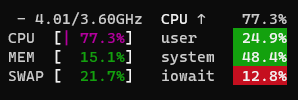

# benchmark

## Übersicht

Kann dabei helfen, mögliche Lancache-Engpässe (bottlenecks) zu identifizieren, in der Regel die Geschwindigkeit des Datenträgers beim Schreiben bzw. Lesen. Kann sowohl Server- als auch Clientseitig verwendet werden.

`benchmark` nutzt die selbe Logik beim Herunterladen wie `prefill`, allerdings mit den folgenden Vorteilen:

- Portabel: keine Anmeldung bei Steam nötig, um den Benchmark zu starten.
- Kann auf mehreren Geräten parallel verwendet werden, ohne Anmeldung.
- Fasst mehrere Apps in einen gemeinsamen, kontinuierlichen Download zusammen, ohne Pausen.
- Reproduzierbar: Führt jedes Mal den exakt gleichen Download aus.
- Zufallsbasiert: Anfragen werden in zufälliger Reihenfolge verarbeitet.

Zuerst wird mit dem Unterbefehl `setup` ein Testpaket an Apps erstellt, welches dann beliebig oft mit dem Unterbefehl `run` als Benchmark heruntergeladen werden kann.

---

## setup [Einrichten]

 

Erstellt ein Testpaket bestehend aus mehreren Apps, welches für Benchmarks mit dem Unterbefehl `run` verwendet wird. Im Regelfall kommt das ideale Testpaket der echten Nutzlast möglichst nahe. Das bedeutet, es enthält möglichst die gleichen Apps, die auch im regulären Betrieb heruntergeladen werden. Das kann beispielsweise mit dem Befehl `./SteamPrefill benchmark setup --use-selected` eingerichtet werden. Ein Benchmark kann auch eingerichtet werden, indem die AppID von einer oder mehreren Apps angegeben wird, oder eines der Voreinstellungen wie `--preset SmallChunks` oder `--preset LargeChunks` ausgewählt wird.

!!! Warning
    Dieser Benchmark wird im Regelfall verwendet, um die Lese- und Schreibgeschwindigkeiten des Datenträgers zu testen. Linux legt gelesene Dateien im Arbeitsspeicher ab, um regelmäßig gelesene Dateien schneller bereitstellen zu können. Um realistische und genaue Ergebnisse zu erzielen, in denen Dateien nur vom Datenträger und nicht aus dem Arbeitsspeicher gelesen werden, muss das Testpaket des Benchmarks größer sein als der verfügbare Arbeitsspeicher.

Sobald das Testpaket erfolgreich erstellt wurde, wird eine Zusammenfassung mit einigen Details angezeigt. Die Verteilung der Chunk-Größen gibt aufschluss über die Charakteristik des erstellten Testpakets. Im besten Szenario sind die Chunks alle 1 MiB oder größer, im schlechtesten Fall sind alle sehr klein. Die Größe der Chunks ist nicht veränderbar, da die Chunks von den Steam servern genau so bereitgestellt werden. Die Verteilung wird hier nur angezeigt, um genauer zu erkennen, was genau getestet wird.

<!-- Markdown columns determine width based on the the longest cell.  &nbsp; forces the length to be longer, so --use-selected doesn't get broken into two lines  -->

| Option &nbsp; &nbsp; &nbsp; &nbsp; &nbsp; &nbsp; &nbsp; | Wert                     |                                                                                                                                                                                                                                                                             |
| ------------------------------------------------------- | ------------------------ | --------------------------------------------------------------------------------------------------------------------------------------------------------------------------------------------------------------------------------------------------------------------------- |
| --use-selected                                          |                          | Erstellt ein Testpaket anhand der zuvor mit `select-apps` ausgewählten Apps. In den meisten Fällen empfohlen, da dies wahrscheinlich die Apps sind, die während echter Nutzung heruntergeladen werden.                                                                      |
| --all                                                   |                          | Erstellt ein Testpaket mit allen Steam Apps in deiner Bibliothek.                                                                                                                                                                                                           |
| --appid                                                 |                          | Die ID von einer oder mehreren Apps, welche im Testpaket enthalten sein sollen. Nützlich, um spezifische Apps zu testen, ohne die zuvor ausgewählten Apps zu verändern. Die AppIDs können auf [SteamDB](https://steamdb.info/) gefunden werden.                             |
| --no-ansi                                               |                          | Alle Ausgaben erfolgen in Klartext, anstatt der visuell ansprechenden Farben und Fortschrittsbalken. Sollte nur in Terminals verwendet werden, die ANSI nicht unterstützen, oder wenn die Ausgabe in eine Datei umgeleitet wird. Die meisten Terminals unterstützen ANSI.   |
| --preset                                                | SmallChunks, LargeChunks | Kann verwendet werden, um schnell Testpakete mit unterschiedlichen Zusammensetzungen zu testen. LargeChunks (große Chunks) sind mit Chunks nahe an 1 MiB Größe ein ideales Szenario, während SmallChunks (kleine Chunks) den schlechtesten Fall mit kleinen Dateien zeigt.  |

---

## run [Ausführen]

Startet mehrere Benchmark-Durchläufe mit dem zuvor via `benchmark setup` erstellten Testpaket. Nützlich um den Durchsatz des Lancache Servers zu testen und mögliche Leistungsprobleme und Engpässe zu finden.

<u>** Aufwärmen **</u>

 

Im ersten Schritt wird der Benchmark initialisiert und das Testpaket geladen. Das zuvor mit `benchmark setup` erstellte Testpaket wird mit einer zufälligen Reihenfolge der Anfragen geladen.

Als nächstes wird das Testpaket "aufgewärmt", was aus mehreren Gründen wichtig ist:

- Es stellt sicher, dass alle Dateien heruntergeladen und von Lancache zwischengespeichert wurden
- Es füllt den Arbeitsspeicher des Servers einmal mit neuen Dateien, um sicherzugehen, dass die nachfolgenden Anfragen des Benchmarks vom Datenträger und nicht aus dem Arbeitsspeicher gelesen werden
- Es wärmt den Prozessor physisch auf, um mögliche Schwankungen zwischen den Durchläufen zu minimieren

<u>** Durchlauf **</u>

Nach dem Aufwärmen fängt `benchmark run` an, dasselbe Testpaket so oft in einer Schleife herunterzuladen, wie mit `--iterations` (Standard: 5) angegeben. Nach jedem durchlauf wird die durchschnittliche Geschwindigkeit des Durchlaufs angezeigt.

 

Sobald alle Durchläufe abgeschlossen wurden, wird eine Zusammenfassung mit den niedrigsten, höchsten und durchschnittlichen Geschwindigkeiten angezeigt:

 

<u>** Engpässe identifizieren **</u>

Obwohl `benchmark run` nützlich sein kann, um eine allgemeine Übersicht von der Leistung des Servers zu erhalten, kann es alleine keine Engpässe identifizieren. Stattdessen ist es als ein weiteres Hilfsmittel gedacht um dir zu helfen, Engpässe zu identifizieren, indem eine konstante und gleichmäßige Last erzeugt wird.

Es wird empfohlen, während der Benchmark läuft, eine Art von Programm zur Systemüberwachung zu verwenden, um zu erkennen, wie der Server mit der Belastung umgeht. Es gibt viele nützliche Programme, wie beispielsweise [Glances](https://github.com/nicolargo/glances), welches eine visuelle Übersicht des Systems darstellt.

Zwei wichtige Indikatoren, die beobachtet werden sollten, sind die `CPU`-Auslastung des Prozessors, sowie der Wert `iowait`. Die meisten Engpässen entstehen entweder durch die Geschwindigkeit des Prozessors, oder durch die Geschwindigkeit des Datenträgers.

{: style="width:350px"}

# Optionen

| Option &nbsp; &nbsp; &nbsp; &nbsp; &nbsp; &nbsp; &nbsp; | &nbsp; &nbsp; &nbsp; | Werte       | Standard |                                                                                                                                                                                                                                                                           |
| ------------------------------------------------------- | -------------------- | ----------- | -------- | ------------------------------------------------------------------------------------------------------------------------------------------------------------------------------------------------------------------------------------------------------------------------- |
| --concurrency                                           | -c                   | 1-100       | **30**   | Die maximale Anzahl an Anfragen, die gleichzeitig bearbeitet werden. Eine höhere Anzahl kann den Durchsatz erhöhen, zu viele Anfragen können sich aber negativ auswirken, wenn Lancache nicht mehr alle Anfragen rechtzeitig bearbeiten kann.                             |
| --iterations                                            | -i                   | 1-25        | **5**    | Die Anzahl an Durchläufen des Benchmarks.                                                                                                                                                                                                                                 |
| --unit                                                  |                      | bits, bytes | **bits** | Gibt an, in welcher Einheit die gemessenen Geschwindigkeiten angezeigt werden.                                                                                                                                                                                            |
| --no-ansi                                               |                      |             |          | Alle Ausgaben erfolgen in Klartext, anstatt den visuell ansprechenden Farben und Fortschrittsbalken. Sollte nur in Terminals verwendet werden, die ANSI nicht unterstützen, oder wenn die Ausgabe in eine Datei umgeleitet wird. Die meisten Terminals unterstützen ANSI. |
