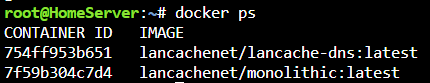
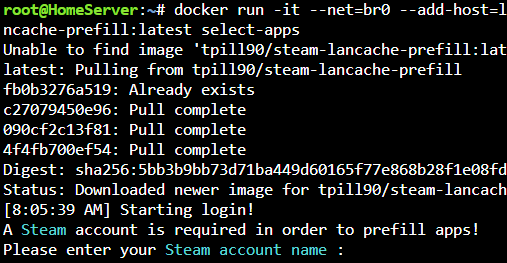

# Unraid Install Guide

This guide is written to help UNRAID users successfully download **SteamPrefill** on their UNRAID Lancache caching server. 

## Prerequisites

Prior to installing SteamPrefill via docker you should ensure you have a working Lancache caching and Lancache DNS server installed on your system.

!!! note
    These steps assume that you are running Lancache caching server as a docker container on a custom network configured for your own subnet. Although could be adapted to suit your own network setup.
    
{: style="width:430px"}

To confirm this open up a **terminal** session to your unraid server, and enter the following:

```bash
docker ps

```
You should see these running containers along with any other docker containers you may be running.

{: style="width:430px"}

## Installing SteamPrefill Docker Image

Again from your UNRAID **terminal** you will download and run the **SteamPrefill** Docker image.


!!! note
    ```--net=br0```
    (this is to connect the container to your custom bridge network)

    ```--add-host=lancache.steamcontent.com:192.168.2.140```
    (this is to tell the container the IP Address of your Lancache Server running on your custom network)
    
Next you will run the full command with your network parameters.    

```bash
docker run -it --net=br0 --add-host=lancache.steamcontent.com:192.168.2.140 --rm -v ${PWD}/Config:/Config tpill90/steam-lancache-prefill:latest select-apps
```

If this is the first time running this command you should see docker retrieve the image from the docker hub and then prompt you for your Steam login.

{: style="width:430px"}

In this case we have passed the `select-apps` switch at the end of the input but you can refer to the [Detailed command usage](https://github.com/tpill90/steam-lancache-prefill/wiki/Detailed-Command-Usage) to perform different tasks.

