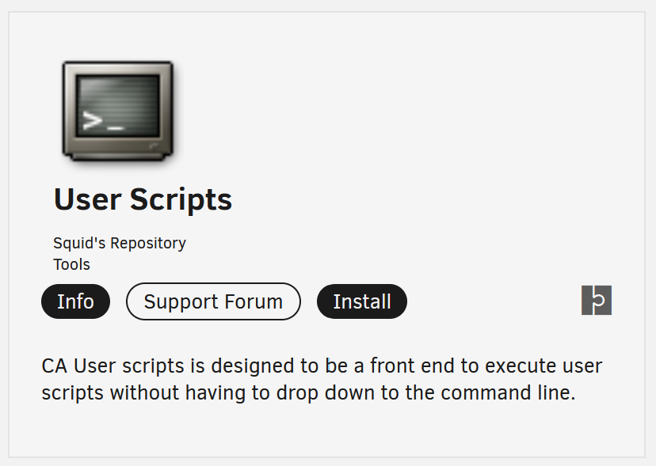
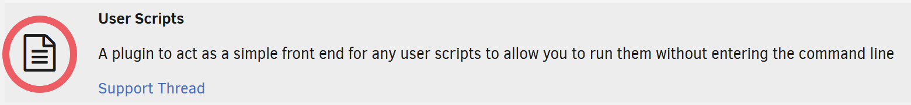

# Unraid Setup Guide

Prior to installing {{prefillName}} via docker you should ensure you have a working Lancache caching and Lancache DNS server installed on your system.

!!! note
    These steps assume that you are running Lancache caching server as a docker container on a custom network configured for your own subnet.
    
{: style="width:530px"}

## Installing {{prefillName}} Docker Image

Again from your Unraid terminal you will download and run the **{{prefillName}}** Docker image.

!!! note
    ```--add-host={{cache_trigger_domain}}:XXX.XXX.XXX.XXX``` is required in order to tell the container the IP Address of your Lancache server running on your custom network.  If not specified, **{{prefillName}}** will be unable to locate the Lancache server, and will be unable to prefill.
    
Next you will run the following command to setup the container, and start configuring which apps to prefill.

```bash
docker run -it --rm \
  --net=br0 \
  --add-host={{cache_trigger_domain}}:XXX.XXX.XXX.XXX  \
  --volume /mnt/user/appdata/{{prefillName}}:/Config \
  tpill90/{{repo_name}}:latest \
  select-apps
```

To get familiarized with how to use **{{prefillName}}**, see the [Getting Started](https://github.com/tpill90/{{repo_name}}#getting-started) guide.

## Setting up a schedule

The [User Scripts Community App](https://forums.unraid.net/topic/48286-plugin-ca-user-scripts/) can be used to create and configure custom scheduled jobs on Unraid.  To begin, ensure that the app is installed from Unraid's *App* tab, if it isn't already installed.

{: style="height:300px"}

After installing **User Scripts**, click Unraid's *Plugins* tab, then the **User Scripts** icon to open up the settings for scheduled jobs.
{: style="width:830px"}

Next, add a new script by clicking *ADD NEW SCRIPT*, and give it the name `{{prefillName}}`.  After it has been created, click the orange gear next to `{{prefillName}}`, and select *EDIT SCRIPT*.
Adding the following command will configure the scheduled job to run the `prefill` command every time it is configured.  Be sure sure to change `XXX.XXX.XXX.XXX` to your Lancache server IP.

!!! note
    This command is almost identical to the one we used previously, except for `--it` being omitted.  This will make the container run non-interactively, as required by **User Scripts**

```bash
#!/bin/bash
docker rm -f {{prefillName}} &>/dev/null && echo 'Removed old container from previous run';
docker run --rm --name {{prefillName}} \
  --net=br0 \
  --add-host={{cache_trigger_domain}}:XXX.XXX.XXX.XXX  \
  --volume /mnt/user/appdata/{{prefillName}}:/Config \
  tpill90/{{repo_name}}:latest \
  prefill
```

After saving changes, the final step will be to decide on a schedule, and configure that schedule.  Change the schedule drop down from *Schedule Disabled*, to *Custom*, which will allow you to specify your desired schedule.  Jobs are configured by specifying a *Cron expression* that describes the schedule to run on.

Some examples of cron expressions:

| Schedule | Cron Expression |
| --- | --- |
| Every day at 2am | `0 2 * * *` |
| Every 4 hours | `0 */4 * * *` |

If the above examples don't cover your use case, [crontab.guru](https://crontab.guru/) is an online cron expression editor that can interactively edit cron expressions, and explain what they mean.

Finally after entering a cron expression, click *APPLY* to save your cron expression.  You should now be all set to have **{{prefillName}}** run on a schedule!

## Next Steps

If you are new to **{{prefillName}}** and would like an introductory tutorial, see the [Getting Started](https://github.com/tpill90/{{repo_name}}#getting-started) guide. 

Answers to common issues and questions can be found at [Frequently Asked Questions](https://github.com/tpill90/{{repo_name}}#frequently-asked-questions).  
