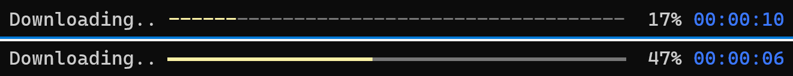

# Windows Installationsanleitung

## {{prefill_name}} installieren

1.  Öffne die [Releases](https://github.com/tpill90/{{repo_name}}/releases) Seite auf Github.
2.  Lade die aktuellste Version für Windows herunter. Der Dateiname sollte ungefähr so aussehen: `{{prefill_name}}-X.Y.Z-win-x64.zip`.
3.  Entpacke die heruntergeladene Datei in ein beliebiges Verzeichnis deiner Wahl auf deinem System.

---

## Optionale Windows Einrichtung

Für eine angenehmere Verwendung von **{{prefill_name}}** und schönere UI Ausgaben wird empfohlen, die Konsole zur Verwendung von Unicode zu konfigurieren.

{: style="width:730px"}

Da die normale Konsole in Windows kein UTF8 unterstützt, solltest du darüber nachdenken **Windows Terminal** aus dem [Microsoft App Store](https://apps.microsoft.com/store/detail/windows-terminal/9N0DX20HK701), or [Chocolatey](https://community.chocolatey.org/packages/microsoft-windows-terminal) zu installieren.

Sobald **Windows Terminal** installiert wurde, musst du trotzdem noch Unicode aktivieren, da es standartmäßig deaktiviert ist. Führe den folgenden Befehl in Powershell ein, um Unicode zu aktivieren:

```powershell
if(!(Test-Path $profile))
{
    New-Item -Path $profile -Type File -Force
}
if(!(gc $profile).Contains("OutputEncoding")) 
{ 
    ac $profile "[console]::InputEncoding = [console]::OutputEncoding = [System.Text.UTF8Encoding]::new()";
    & $profile; 
}
```

---

## Nächste Schritte

Wenn du **{{prefill_name}}** das erste Mal benutzt und eine Anleitung haben willst, schaue dir [Getting Started](https://github.com/tpill90/{{repo_name}}#getting-started) an.

Antworten auf häufig gestellte Fragen und Probleme können unter [Frequently Asked Questions](https://github.com/tpill90/{{repo_name}}#frequently-asked-questions) gefunden werden.

